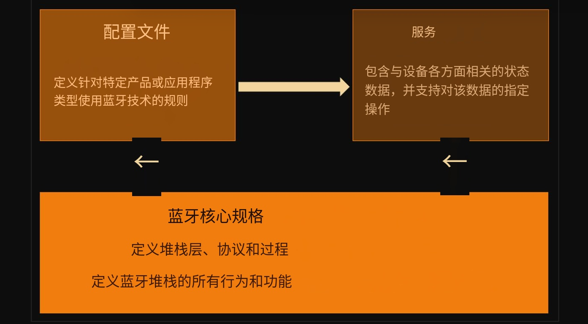

2024/9/20

ASRPRO 语音识别模块，支持图形化编程，比较简单。
想做一个智能语音控制桌面小屏幕，或者语音控制的小项目，就可以使用这个模块。
可是我现在研究的是FPGA，怎么样能让他俩结合起来呢？

我希望写一个程序，让ASRPRO模块执行相应的操作。
具体的指令：“段段姐”，是唤醒的指令。“段段姐，打开灯光”，是打开灯光的指令。“段段姐，关闭灯光”，是关闭灯光的指令。“段段姐，打开风扇”，是打开风扇的指令。
“段段姐，关闭风扇”，是关闭风扇的指令。“段段姐，打开空调”，是打开空调的指令。“段段姐，关闭空调”，是关闭空调的指令。“段段姐，打开电视”，是打开电视的指令。
“段段姐，关闭电视”，是关闭电视的指令。“段段姐，打开电脑”，是打开电脑的指令。“段段姐，关闭电脑”，是关闭电脑的指令。“段段姐，打开音响”，是打开音响的指令。
“段段姐，关闭音响”，是关闭音响的指令。“段段姐，打开窗帘”，是打开窗帘的指令。“段段姐，关闭窗帘”，是关闭窗帘的指令。每当我说出这些指令的时候我想要的操作就会执行。

看了一下官方的使用例程，每当我说一个指令，这个指令会识别出这段语音，然后回复我一段它自己说的话，在回应我的时候，他会使用我电脑里面的声音。
所以，我只需要把ASRPRO模块的回应，换成我电脑里面的声音，就可以实现回应语句的选择了。

同时在回应我的时候，ASRPRO会将一个flag信号置为不同的数字，我只需要在我的程序里面，
根据这个flag信号的不同数字，让FPGA来执行不同的操作就可以了。

比如，我说“段段姐，开一下灯”，ASRPRO会回应“好的”，然后将flag信号置为1，
接下来我需要，让我的FPGA来执行打开灯光的操作。

那我有一个疑问了，如果我的灯光，是在远处的，我怎么让FPGA来控制它呢？

因为FPGA本身不具备直接控制外部设备（如灯光、风扇等）的能力。FPGA主要用于处理数字信号
，如图像处理、音频处理等，以及控制硬件设备。要实现FPGA控制外部设备，那我可以通过wifi或者蓝牙
来控制远处的灯光吗？

问了一下codegee，它说可以。是的，你可以使用WiFi或蓝牙来控制远处的灯光。
具体来说，可以将FPGA连接到WiFi或蓝牙模块，然后通过这些模块与远程设备进行通信。
这样，你就可以通过FPGA来控制远处的灯光了。

具体怎么连接FPGA与蓝牙模块，codegee说：可以使用蓝牙模块与FPGA进行通信。
蓝牙模块接收到远处灯光的亮灭状态之后，通过串口把led的亮灭信号传给FPga芯片，
然后FPGA芯片根据led的亮灭信号来控制led的亮灭。

整个过程是这样的：人说出“段段姐，打开灯光”，然后ASRPRO模块识别出指令并回应“好的”，
然后将flag信号置为1，FPGA接收到1，表示操控蓝牙模块来操控灯光的亮灭。

/*************************************************************************************************************************************************************************************/

那我现在要买一个ASRPRO吗？
还是不要了，我想先学习一下蓝牙协议，然后再去买一个ASRPRO模块。然后再买一个蓝牙模块。
蓝牙需要学什么呢？
蓝牙协议是用于无线通信的协议，它允许设备之间进行数据传输。要学习蓝牙协议，你需要了解以下内容：

1. 蓝牙协议栈：蓝牙协议栈是蓝牙设备之间进行通信的框架。
你需要了解蓝牙协议栈的基本结构和功能，包括蓝牙协议栈的层次结构、
蓝牙协议栈的各个层的作用和功能等。

2024/9/21 6:41

2. 蓝牙设备类型：蓝牙设备类型包括蓝牙主机（如手机、电脑等）和蓝牙从机（如耳机、鼠标等）。
你需要了解蓝牙设备类型的分类和特点，以及蓝牙设备之间的通信方式。

3. 蓝牙连接建立：蓝牙连接建立是蓝牙设备之间进行通信的前提。
你需要了解蓝牙连接建立的过程，包括蓝牙设备的配对、连接建立和连接管理等。

4. 蓝牙数据传输：蓝牙数据传输是蓝牙设备之间进行数据交换的主要方式。

有规则就会有协议吗？比如串口协议，iic，spi，usb等。
可是，全世界上的人那么多，但协议相比之下就少得多了，
那一定是制定协议，除了有规则之外，还得有其他的条件。
比如，如何让制定的协议广泛被使用、制定的协议比前几类
协议来说，使用条件、传输速率是否有较大的改善

在淘宝上搜索蓝牙模块，搜索到一个蓝牙模块，下载了它的资料到论文里面，并且把它的压缩包解压之后删除了。我看了一下它的使用手册蓝牙指令，是已经指定的  我不能修改。那么我怎么才能修改蓝牙模块里面的指令呢？

或者我没有必要修改。我最想知道的是FPGA怎么通过操控蓝牙模块让远处的灯光熄灭？
FPGA通过操控蓝牙模块让远处的灯光熄灭的过程如下：

1. 首先，FPGA需要通过蓝牙模块与远处的灯光设备进行通信。这通常需要通过蓝牙协议栈来实现，例如蓝牙协议栈的GATT（Generic Attribute Profile）层。蓝牙协议栈是在蓝牙模块里面已经搭建好的吗？

2. FPGA需要发送一个指令给蓝牙模块，告诉蓝牙模块要控制远处的灯光设备。这个指令可以是任何形式，例如一个特定的字符串或者一个特定的数据包。

3. 蓝牙模块接收到FPGA发送的指令后，会通过蓝牙协议栈将指令发送给远处的灯光设备。这通常需要通过蓝牙协议栈的L2CAP（Logical Link Control and Adaptation Protocol）层来实现。

要实现 FPGA 通过蓝牙模块控制远处灯光的熄灭，可以按照以下步骤进行搭建：

**一、所需材料**

1. FPGA 开发板。
2. 蓝牙模块（可以选择常见的 HC-05 等蓝牙串口模块）。
3. 继电器模块。
4. 灯泡及电源。
5. 杜邦线若干。

**二、连接步骤**

1. 将蓝牙模块与 FPGA 开发板连接：
   - 通常蓝牙模块有 VCC（电源）、GND（地）、TXD（发送数据）、RXD（接收数据）等引脚。
   - 将蓝牙模块的 VCC 连接到 FPGA 开发板的合适电源引脚（一般为 3.3V 或 5V，具体参考开发板说明书）。
   - 将蓝牙模块的 GND 连接到开发板的地引脚。
   - 将蓝牙模块的 RXD 连接到 FPGA 开发板的一个可用 GPIO（通用输入输出）引脚，用于接收来自蓝牙模块的数据。
   - 将蓝牙模块的 TXD 连接到 FPGA 开发板的另一个可用 GPIO 引脚，用于向蓝牙模块发送数据（在这个项目中可能用不到发送功能，但连接上以备将来扩展）。

2. 连接继电器模块：
   - 继电器模块一般也有 VCC、GND、控制信号输入引脚等。
   - 将继电器模块的 VCC 连接到 FPGA 开发板的电源引脚。
   - 将继电器模块的 GND 连接到开发板的地引脚。
   - 将继电器模块的控制信号输入引脚连接到 FPGA 开发板的另一个 GPIO 引脚，这个引脚将用于控制继电器的通断。

3. 连接灯光：
   - 将灯泡与合适的电源连接。
   - 将灯泡的电源线通过继电器模块的触点进行连接。当继电器闭合时，灯光通电点亮；当继电器断开时，灯光断电熄灭。

**三、软件配置**

1. 在 FPGA 开发环境中，对连接到蓝牙模块和继电器模块的 GPIO 引脚进行配置。
2. 设置一个逻辑，当 FPGA 从蓝牙模块接收到特定的指令（例如一个特定的字符或字符串）时，控制连接继电器的 GPIO 引脚输出高电平或低电平，从而控制继电器的通断，实现灯光的亮灭控制。

**四、蓝牙模块配置**

1. 如果使用的是需要配置的蓝牙模块（如 HC-05），可以通过串口连接到电脑，使用特定的串口调试工具进行配置。
2. 配置蓝牙模块的名称、配对密码等参数，确保 FPGA 开发板能够与蓝牙模块成功配对连接。

通过以上步骤，你就可以实现 FPGA 通过蓝牙模块控制远处灯光的熄灭。在实际操作中，可能需要根据具体的硬件和软件环境进行一些调整和优化。

这个模块需要，把继电器和led连起来，那就有了距离限制了，那我想远距离控制呢？

既然它可以当作串口使用。我说出“段段姐，打开灯光”，然后ASRPRO模块识别出指令并回应“好的”，
然后将flag信号置为1，FPGA接收到1，表示操控蓝牙模块来操控灯光的亮灭。

如果说之前的串口传输,也就是从电脑给fpga芯片发送信息是通过我自己自定义传输信号的话，那么如果我想要实现:说出一个语音指令, FPga芯片做出对应的操作，那么中间的过程就是:我说出一个语音指令,语音模块会把我的指令转换成一串八比特的数据传给蓝牙模块,蓝牙转串口模块传给fpga芯片。fpga芯片操控相应的设备实现相应的操作。

我的语音被语音模块，转换成特定的一串数据，来代表我发出的指令。这串数据传给Fpga，接收到语音模块传来的八位串口信号后，这时候fpga调用。串口发送模块成一串数据给蓝牙模块，蓝牙模块接收到这个数据后，操作远处/fpga直接连接的外设。

所以现在我要写一个语音模块儿。然后在我的top层调用语音模块。语音模块输出一个八位的数据到蓝牙模块，那我也要写一个蓝牙模块。蓝牙模块接收到之后。操作远方的外设。那我要写一个外设的模块。

思路：：：：

FPGA设计：：：：

